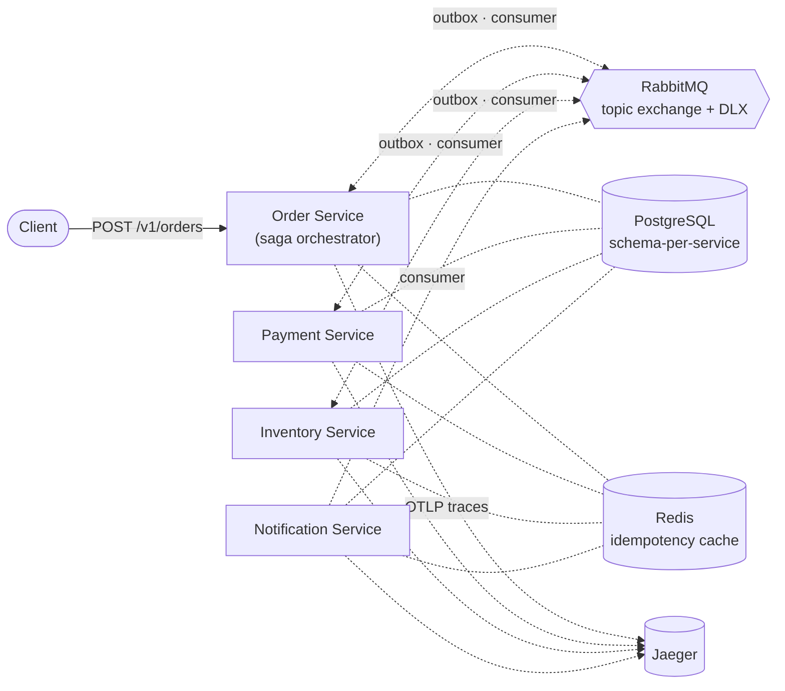
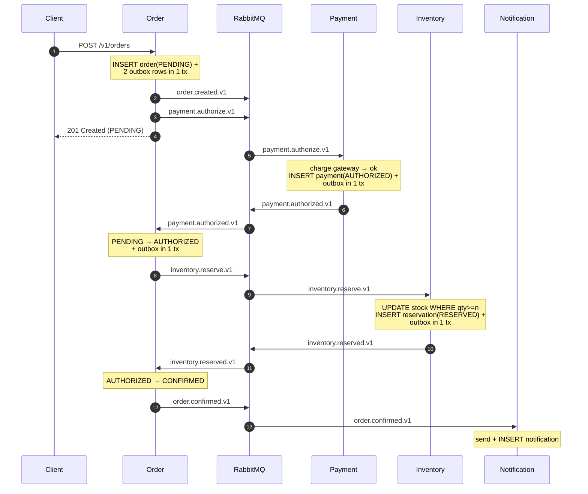
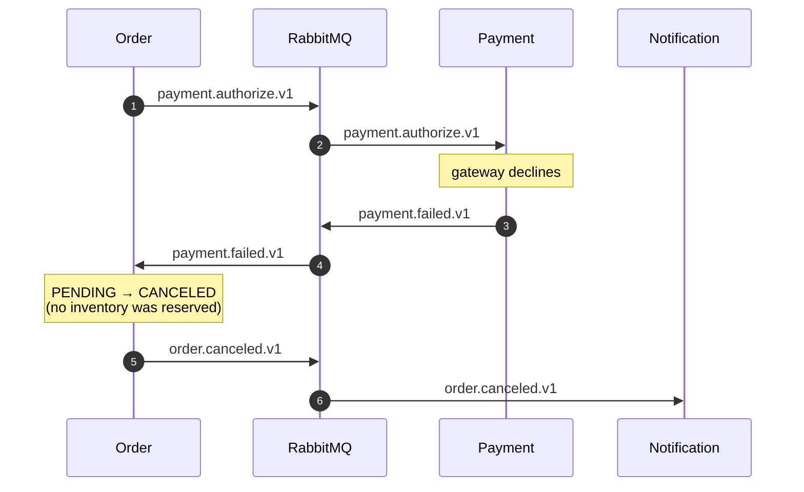
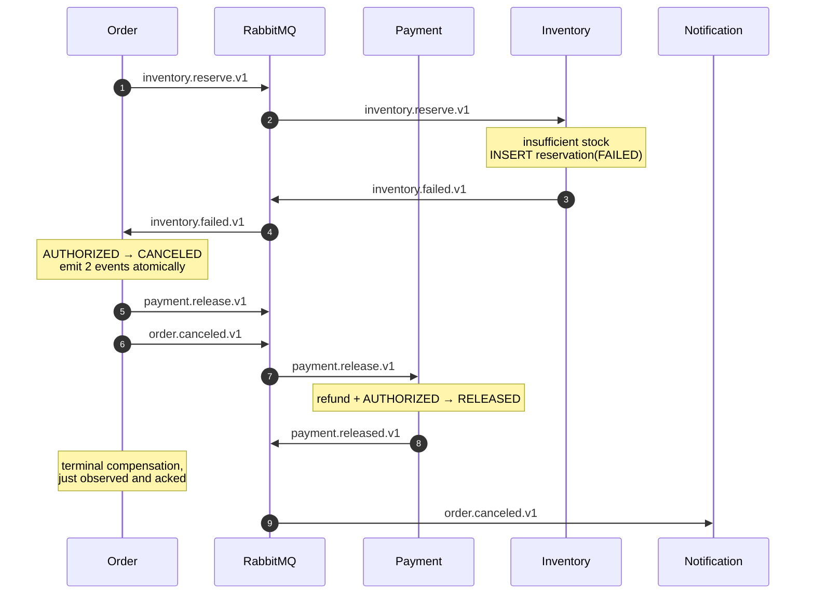

# OrderFlow

> Production-grade event-driven order processing on Go microservices, demonstrating the **Saga pattern**, **Outbox pattern**, **idempotent consumers**, and **distributed tracing** end-to-end.

[](https://github.com/lilik-setyawan/orderflow/actions/workflows/ci.yml)


OrderFlow simulates the order lifecycle of an e-commerce platform across **four independently deployable Go services**. It is built as a reference implementation for the patterns that matter when distributed systems start to fail in production: partial failures, duplicate messages, lost events, and the human cost of debugging across service boundaries.

---

## Why this exists

Most "microservices demo" repos stop at HTTP between services and call it a day. Real production systems need answers for:

- What happens when payment succeeds but inventory has already sold out?
- What happens when the message broker delivers the same event twice?
- What happens when the database commit succeeds but the event publish fails?
- How do you trace a single user request across four services and a message broker?

OrderFlow answers each one with a documented pattern and code you can read in under an hour.

---

## Architecture

### System overview



Each service owns its own PostgreSQL schema. Communication is asynchronous over RabbitMQ topic exchange `orderflow`, with a parallel `orderflow.dlx` for dead letters.

### Saga flow — happy path



### Saga flow — payment declined (compensation #1)



### Saga flow — inventory failed (compensation #2)



### Patterns demonstrated

| Pattern | Where it lives | Why it matters |
|---|---|---|
| **Outbox** | every service that publishes — write business state + outbox row in one tx; `pkg/outbox` dispatcher polls and publishes with confirms | atomic commit + event publish; no lost events, no events without state change |
| **Idempotency (3 layers)** | Redis fast-skip → DB `UNIQUE` constraint → domain state guards | safe under at-least-once delivery without duplicating side effects |
| **Saga (orchestration)** | Order service drives state; downstream services emit reply events | distributed transactions without 2PC |
| **Optimistic concurrency** | every aggregate has a `version` column; `UPDATE ... WHERE version = $1` | safe parallel writers; `RowsAffected() == 0` ⇒ retry |
| **Conditional stock decrement** | `UPDATE stocks WHERE quantity >= $n` | prevents oversell under contention without explicit locks |
| **Dead-letter exchange** | `orderflow.dlx` mirrors all routing keys | bad messages are observable & replayable, not lost |
| **Graceful shutdown** | `signal.NotifyContext` + `srv.Shutdown` + cancellable consumers | no message loss on deploy |
| **Structured logging + trace correlation** | zerolog + OpenTelemetry → Jaeger | one `traceID`, four services, instant root cause |
| **Hexagonal architecture** | `domain` → `port` → `usecase` → `adapter` per service | swap infrastructure without touching business logic; testable in isolation |

---

## Tech stack

- **Language**: Go 1.25
- **Sync API**: REST (chi)
- **Async messaging**: RabbitMQ — topic exchange, durable quorum queues, publisher confirms, DLX
- **Storage**: PostgreSQL (schema-per-service via `search_path`), Redis (idempotency cache)
- **Observability**: OpenTelemetry → Jaeger, zerolog (structured)
- **Testing**: testify + `go.uber.org/mock` (gomock)
- **Build**: Docker Compose, Makefile, embedded SQL migrations (`go:embed` + custom runner)

---

## Repository layout

```
orderflow/
├── proto/                          # (reserved for gRPC contracts)
├── pkg/                            # shared, transport-agnostic
│   ├── events/                     # Envelope + cross-service payload types
│   ├── outbox/                     # transactional outbox + dispatcher
│   ├── idempotency/                # Redis Seen/Mark cache
│   ├── observability/              # zerolog + OTel wiring
│   ├── rabbitmq/                   # topology + publisher with confirms
│   ├── pgx/                        # pgxpool helper
│   └── dbmigrate/                  # embedded-SQL migration runner
├── services/
│   ├── order/                      # saga orchestrator + REST entrypoint
│   ├── payment/                    # mock gateway + AMQP-only API
│   ├── inventory/                  # optimistic stock decrement
│   └── notification/               # log notifier + record per send
├── deployments/docker/             # (reserved)
├── scripts/init-postgres.sql       # creates the four schemas
├── docker-compose.yml              # postgres, rabbitmq, redis, jaeger
└── Makefile
```

### Service layout (hexagonal — same shape for all four)

```
cmd/server/main.go                  # composition root (wires adapters → ports)
internal/
  domain/                           # entities + business rules (zero infra deps)
  app/
    port/                           # interfaces (the ports)
    usecase/                        # use cases that orchestrate the domain via ports
  adapter/
    postgres/                       # driven: repository implementation
    idgen/                          # driven: UUIDv7 IDGenerator
    http/                           # driving: REST entry
    consumer/                       # driving: RabbitMQ consumer
  config/                           # env-driven config (envconfig)
migrations/                         # SQL files + go:embed
```

**Dependency rule**: `domain` imports nothing from this service. `app/usecase` depends on `domain` and `app/port` only. `adapter/*` may depend on `app/port`, `domain`, and infrastructure. Only `cmd/server/main.go` knows about both sides — that's the composition root.

---

## Quick start

```bash
make up                  # postgres + rabbitmq + redis + jaeger
cp .env.example .env

# in four terminals (or via process manager):
make run-order
make run-payment
make run-inventory
make run-notification

# trigger a happy-path saga:
curl -X POST localhost:8081/v1/orders -H 'content-type: application/json' -d '{
  "customer_id":"c1",
  "items":[{"sku":"A","quantity":3,"price":1000}]
}'

# fetch the order to see the saga progress to CONFIRMED:
curl localhost:8081/v1/orders/<id>
```

**Force a failure path**:
- Use SKU `Z` (not seeded) → inventory.failed → CANCELED with payment compensation.
- Lower `PAYMENT_GATEWAY_SUCCESS_RATE=0.0` → every order is declined.

**Operations UIs**:
- RabbitMQ management: <http://localhost:15672> (orderflow / orderflow)
- Jaeger: <http://localhost:16686>
- Postgres: `make psql`

---

## Testing

```bash
make test               # all unit tests (118 tests)
go test -race ./...     # with race detector
make mocks              # regenerate gomock mocks (after editing ports)
```

### Coverage (unit only — DB/AMQP integration is a follow-up)

| Layer | Coverage |
|---|---|
| domain (all four services) | **92 – 100 %** |
| app/usecase (all four services) | **74 – 83 %** |
| pkg/events | **87.5 %** |

---

## Roadmap

- [x] Project skeleton + docker-compose infra
- [x] Order service: REST + saga orchestrator + outbox
- [x] Payment service: mock provider + idempotent authorize/release
- [x] Inventory service: optimistic stock reservation + compensation
- [x] Notification service: log notifier + idempotent record
- [x] Hexagonal architecture across all services
- [x] Unit tests with gomock — domain + use cases ≥ 80 %
- [x] CI: lint, vet, race, coverage, mocks-uptodate
- [ ] OpenTelemetry tracing across all four services (wiring code present, instrumentation TBD)
- [ ] Load test scenario (k6) + benchmark numbers
- [ ] Integration tests with testcontainers (postgres + rabbitmq)
- [ ] Helm chart for k8s deploy

---

## License

MIT
